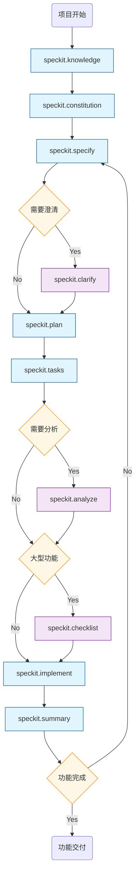
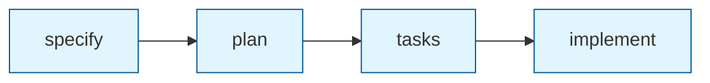

# AI-SDD (speckit和一些agent)使用指南

> 规范驱动开发工作流框架 - 从需求到实现的完整流水线

## 1. 概述

### 1.1 什么是 SpecKit？

SpecKit 是一套规范驱动开发（Specification-Driven Development）的工作流框架，通过结构化的命令流水线，将模糊的自然语言需求转化为可执行的任务列表，并指导代码实现。

**核心理念**：

- **规范先行**：先明确"做什么"，再讨论"怎么做"
- **TDD 驱动**：测试先于实现，验证先于编码
- **渐进细化**：从抽象需求到具体任务，逐层细化
- **质量门禁**：每个阶段都有检查清单验证

### 1.2 命令流水线

**首次使用**（挂载知识库 + 创建项目章程）：

```
/speckit.knowledge → /speckit.constitution
         │                    │
    挂载L0/L1知识库       创建企业章程
  (.knowledge/upstream/)  (constitution.md)
         ↓                    ↓
```

**功能开发流程**：

```
/speckit.specify → /speckit.clarify → /speckit.plan → /speckit.tasks → /speckit.analyze → /speckit.checklist → /speckit.implement
       │                 │                 │                │                 │                  │                   │
   创建规范         澄清问题并更新      制定技术方案      生成任务列表      一致性检查        生成检查清单         执行实现
   (spec.md)         (spec.md)        (plan.md)        (tasks.md)        (验证报告)      (checklists/*.md)       (代码)

💡 提示：对于大型功能（>10 个任务或涉及多个模块），强烈建议执行 /speckit.checklist 生成检查清单，确保实现质量。
```

**完整流程：**



> **大型功能判断标准**：任务数 >10 或涉及多个模块时，建议执行 `/speckit.checklist`

**核心流程（简化版）：**



---

## ⚡ 1.3 轻量级 SDD 使用方式（小需求可以使用）

> **🎯 重要提示**：对于小功能开发场景，推荐使用轻量级 SDD 流程 `/simplesdd:feature-dev`，它更简洁高效，适合日常开发。

**一键启动**：

```bash
/simplesdd:feature-dev <功能描述>
```

**7 阶段概览**：

| 阶段        | 名称          | 核心活动                                 | 产出     |
| ----------- | ------------- | ---------------------------------------- | -------- |
| **1** | 🔍 发现       | 理解需求、验证术语、检查仓库范围         | 需求确认 |
| **2** | 📂 代码库探索 | 并行启动 code-explorer 代理分析现有代码  | 模式发现 |
| **3** | ❓ 澄清问题   | 识别歧义和边缘情况，等待用户确认         | 问题清单 |
| **4** | 🏗️ 架构设计 | 多方案对比（最小改动/清洁架构/务实平衡） | 设计选型 |
| **5** | ⚙️ 实现     | 用户批准后按选定架构编码                 | 功能代码 |
| **6** | ✅ 质量审查   | 并行 code-reviewer 代理检查质量          | 审查报告 |
| **7** | 📋 总结       | 记录完成工作、合规状态、后续建议         | 工作总结 |

**与完整 SDD 的区别**：

- ✅ 无需手动执行多个 `/speckit.*` 命令
- ✅ 自动加载所需知识库
- ✅ 内置合规检查（L0/L1/L2）
- ✅ 交互式引导，边做边确认

---

### 1.4 知识层级体系

SpecKit 采用多层知识架构：

**知识库层级**（通过 `/speckit.knowledge` 挂载）：

| 层级         | 名称                 | 位置                                   | 说明                           |
| ------------ | -------------------- | -------------------------------------- | ------------------------------ |
| **L0** | Enterprise（企业级） | `.knowledge/upstream/L0-enterprise/` | 企业统一规范，不可覆盖         |
| **L1** | Project（项目级）    | `.knowledge/upstream/L1-project/`    | 项目特定知识库，需用户提供地址 |

**项目内知识层级**：

| 层级         | 名称                 | 位置                                | 说明               |
| ------------ | -------------------- | ----------------------------------- | ------------------ |
| **L0** | Constitution（章程） | `.specify/memory/constitution.md` | 强制约束，不可覆盖 |
| **L1** | Project（项目级）    | `CLAUDE.md`                       | 项目标准与规范     |
| **L2** | Repository（仓库级） | `specs/{feature}/`                | 功能特定知识       |

---

## 2. 目录结构

### 2.1 SpecKit 框架目录

```
.claude/
├── commands/                    # SpecKit 命令定义
│   ├── speckit.specify.md       # 规范创建命令
│   ├── speckit.clarify.md       # 规范澄清命令
│   ├── speckit.plan.md          # 技术规划命令
│   ├── speckit.tasks.md         # 任务生成命令
│   ├── speckit.implement.md     # 实现执行命令
│   ├── speckit.analyze.md       # 一致性分析命令
│   ├── speckit.checklist.md     # 检查清单生成命令
│   └── speckit.taskstoissues.md # 任务转 GitHub Issues
│
.specify/
├── memory/
│   └── constitution.md          # L0 企业级章程（强制约束）
├── templates/
│   ├── spec-template.md         # 规范文档模板
│   ├── plan-template.md         # 技术方案模板
│   ├── tasks-template.md        # 任务列表模板
│   └── checklist-template.md    # 检查清单模板
└── scripts/
    └── bash/                    # 辅助脚本
```

### 2.2 功能目录结构

每个功能在 `specs/` 下创建独立目录：

```
specs/
└── {NNN}-{short-name}/          # 例如: 001-audit-log
    ├── spec.md                  # 功能规范（用户故事、验收标准）
    ├── plan.md                  # 技术方案（架构设计、数据模型）
    ├── tasks.md                 # 任务列表（分阶段、可并行）
    ├── research.md              # 技术调研（可选）
    ├── data-model.md            # 数据模型设计（可选）
    ├── quickstart.md            # 快速开始指南（可选）
    └── checklists/              # 检查清单目录
        ├── requirements.md      # 需求质量检查
        ├── design.md            # 设计质量检查
        └── implementation.md    # 实现质量检查
```

---

## 3. 命令详解

### 3.0 `/speckit.knowledge` - 知识库管理

**用途**：管理多级知识库（L0 企业级、L1 项目级）的挂载、同步和状态查看。

**使用示例**：

```bash
/speckit.knowledge
# 或者执行命令
/speckit.knowledge 更新知识库
```

```

```

**执行流程**：

1. **检查当前状态**：自动检测 L0/L1 知识库的挂载状态
2. **根据状态给出建议**：
   - 未挂载：提示挂载并询问 L1 地址
   - 已挂载：询问是否需要同步

**知识库配置**：

| 级别 | 远程名       | 默认仓库                                                       | 路径                                  |
| ---- | ------------ | -------------------------------------------------------------- | ------------------------------------- |
| L0   | L0-knowledge | `git@github.com:WeTechHK/knowledge-enterprise-standards.git` | `.knowledge/upstream/L0-enterprise` |
| L1   | L1-knowledge | **用户必须提供**                                         | `.knowledge/upstream/L1-project`    |

**状态场景**：

| 场景         | 行为                                         |
| ------------ | -------------------------------------------- |
| 两个都未挂载 | 显示状态 → 询问 L1 地址 → 执行挂载 L0 + L1 |
| 只有 L0      | 显示状态 → 要求提供 L1 地址 → 挂载 L1      |
| 两个都已挂载 | 显示完整状态 → 询问是否同步                 |

**挂载命令**（内部执行）：

```bash
# 挂载 L0（自动）
git remote add L0-knowledge git@github.com:WeTechHK/knowledge-enterprise-standards.git
git subtree add --prefix=.knowledge/upstream/L0-enterprise L0-knowledge main --squash

# 挂载 L1（需要用户提供地址）
git remote add L1-knowledge <用户提供的地址>
git subtree add --prefix=.knowledge/upstream/L1-project L1-knowledge main --squash
```

**同步命令**（内部执行）：

```bash
git subtree pull --prefix=.knowledge/upstream/L0-enterprise L0-knowledge main --squash
git subtree pull --prefix=.knowledge/upstream/L1-project L1-knowledge main --squash
```

**前置要求**：

1. 当前目录是 git 仓库
2. 工作区干净（无未提交修改）
3. 有知识库仓库的 SSH 访问权限

**知识库内容结构**：

```
.knowledge/upstream/
├── L0-enterprise/           # 企业级知识库（不可覆盖）
│   ├── constitution/        # 技术宪法
│   ├── standards/           # 编码规范
│   ├── governance/          # 治理流程
│   └── technology-radar/    # 技术雷达
│
└── L1-project/              # 项目级知识库（部分可覆盖）
    ├── business/            # 业务领域
    ├── architecture/        # 架构知识
    └── standards/           # 项目规范
```

**最佳实践**：

- 在开始任何功能开发之前，先执行 `/speckit.knowledge` 确保知识库已挂载
- L1 知识库地址每个项目独立，包含项目特有的业务和技术知识
- 定期执行同步以获取最新的企业规范和项目知识

---

### 3.1 `/speckit.constitution` - 创建项目章程

**用途**：从项目描述创建企业级技术章程，定义不可覆盖的强制约束。

**输入**：项目的自然语言描述（技术栈、业务领域、架构特点）

**输出**：`.specify/memory/constitution.md` - 企业级章程文档

**使用示例**：

```bash
/speckit.constitution 这是一个web3托管钱包后台项目。使用spring构建后台。
另外，会对接多个saas的web3应用服务。本身也是一个saas服务。
```

**章程核心章节**：

| 章节                                 | 内容                            |
| ------------------------------------ | ------------------------------- |
| **I. 测试驱动开发**            | TDD 流程、覆盖率要求、测试规范  |
| **II. 规则至上架构**           | 知识层级、规则优先级、冲突解决  |
| **III. 分层架构纯粹性**        | 层次定义、依赖方向、禁止事项    |
| **IV. 安全红线**               | 认证授权、输入校验、数据保护    |
| **V. RESTful API 标准化**      | 路径规范、状态码、响应格式      |
| **VI. 生产就绪代码完整性**     | 代码质量标准、禁止 TODO         |
| **VII. 可观测性要求**          | 健康检查、日志规范、链路追踪    |
| **VIII. 简洁性原则**           | YAGNI、KISS、避免过度设计       |
| **IX. 容器化部署规范**         | Dockerfile、镜像标签、K8s 配置  |
| **X. 审计追踪与合规**          | 审计日志、事件驱动、幂等性      |
| **XI. 数据一致性与事务边界**   | 事务规范、乐观锁、幂等性        |
| **XII. 容错韧性与服务治理**    | 超时熔断、服务治理、链路传递    |
| **XIII. 合规性要求**           | 个保法/GDPR、数据留存、等保 2.0 |
| **XIV. Web3 托管钱包安全规范** | 私钥管理、交易安全、热冷分离    |
| **XV. SaaS 多租户架构规范**    | 租户隔离、上下文传递、资源配额  |

**反模式检查清单**（自动生成）：

```markdown
| 序号 | 反模式 | 检测方式 |
|------|--------|----------|
| 1 | Controller 直接访问 Mapper | 代码审查 |
| 16 | 私钥明文存储 | 检查钱包模块存储方式 |
| 19 | 跨租户数据访问 | 检查 SQL 是否携带租户过滤 |
| 22 | 调用未审计第三方合约 | 检查合约地址白名单 |
```

**最佳实践**：

- 章程只需创建一次，后续功能开发无需重复
- 描述要包含：技术栈、业务领域、架构模式（SaaS/微服务等）
- 章程创建后应进行团队评审确认
- 章程修订需遵循语义化版本（MAJOR.MINOR.PATCH）

---

### 3.2 `/speckit.specify` - 创建功能规范

**用途**：从自然语言需求创建结构化的功能规范文档。

**输入**：自然语言功能描述（中文或英文）

**输出**：

- `specs/{NNN}-{short-name}/spec.md` - 功能规范文档
- `specs/{NNN}-{short-name}/checklists/requirements.md` - 需求检查清单
- Git 分支建议：`feature/{short-name}`

**使用示例**：

```
/speckit.specify 我需要为系统的关键业务接口添加审计日志功能，
记录谁在什么时间做了什么操作，支持合规审计查询
```

**生成的 spec.md 结构**：

```markdown
# Feature Specification: 关键功能审计日志

## Overview
[功能概述和目标]

## User Stories

### US1: 开发人员为关键接口添加审计日志 (Priority: P1)
**As a** 开发人员
**I want to** 通过简单的注解方式为关键业务接口添加审计日志
**So that** 在不改变业务逻辑的前提下实现合规要求

**Acceptance Scenarios:**
- **Given** 一个 Controller 方法标注了 @AuditLog 注解
- **When** 该接口被调用
- **Then** 审计日志被自动记录到独立日志文件

## Clarifications
[与 PM/用户确认的问题和答案]

## Out of Scope
[明确不在本次实现范围内的功能]
```

**最佳实践**：

- 输入描述要包含：谁（用户角色）、做什么（核心功能）、为什么（业务价值）
- 优先级标注：P1（必须）、P2（应该）、P3（可以）
- 一个 spec 应该聚焦单一功能领域

---

### 3.3 `/speckit.clarify` - 澄清规范

**用途**：识别规范中不明确的地方，通过提问澄清并更新规范。

**输入**：已有的 spec.md

**输出**：更新后的 spec.md（添加 Clarifications 章节）

**使用示例**：

```
/speckit.clarify specs/001-audit-log/spec.md
```

**澄清流程**：

1. 分析 spec.md 中的模糊点
2. 生成最多 5 个针对性问题
3. 等待用户/PM 回答
4. 将答案编码回 spec.md 的 Clarifications 章节

**典型澄清问题**：

```
1. 审计日志的存储方式是什么？（独立日志文件 vs 数据库 vs 消息队列）
2. 日志保留策略是什么？（保留天数、最大存储容量）
3. 需要支持哪些查询维度？（用户ID、时间范围、操作类型）
4. 敏感信息如何处理？（脱敏规则、哪些字段需要脱敏）
5. 是否需要实时告警？（高风险操作的告警机制）
```

**最佳实践**：

- 在 `/speckit.plan` 之前运行，确保需求清晰
- 将所有澄清结果记录在 spec.md 中，作为后续设计的输入
- 对于复杂功能，可能需要多轮澄清

---

### 3.4 `/speckit.plan` - 制定技术方案

**用途**：基于 spec.md 创建详细的技术实现方案。

**前提**：spec.md 已完成且通过需求检查清单

**输出**：

- `specs/{NNN}-{feature}/plan.md` - 技术方案文档
- `specs/{NNN}-{feature}/data-model.md` - 数据模型设计（如需要）
- `specs/{NNN}-{feature}/research.md` - 技术调研（如需要）
- `specs/{NNN}-{feature}/quickstart.md` - 快速开始指南

**使用示例**：

```
/speckit.plan specs/001-audit-log/spec.md
```

**生成的 plan.md 结构**：

```markdown
# Implementation Plan: 关键功能审计日志

## Technical Context
- **Runtime**: Java 21, Spring Boot 3.x
- **Logging**: Logback with AsyncAppender
- **Storage**: File-based (ELK integration ready)

## Constitution Check
| 章程原则 | 符合性 | 实现方式 |
|----------|--------|----------|
| X. 审计追踪与合规 | ✅ | AOP 实现横切关注点 |
| IV. 安全红线 | ✅ | 敏感信息脱敏后再记录 |

## Project Structure
```

modules/common/src/main/java/cn/wetech/common/wecommon/
├── annotation/
│   └── AuditLog.java           # 审计日志注解
├── aspect/
│   └── AuditLogAspect.java     # AOP 切面
├── service/audit/
│   ├── AuditLogService.java    # 服务接口
│   └── impl/
│       └── AuditLogServiceImpl.java
├── model/audit/
│   └── AuditLogRecord.java     # 日志记录模型
└── enums/
    ├── AuditModule.java        # 模块枚举
    ├── AuditOperationType.java # 操作类型枚举
    └── RiskLevel.java          # 风险等级枚举

```

## Component Design
[组件设计和交互流程]

## Data Flow
[数据流转图]
```

**最佳实践**：

- 方案必须通过 Constitution Check（章程符合性检查）
- 明确技术选型的理由
- 数据模型要考虑查询需求

---

### 3.5 `/speckit.tasks` - 生成任务列表

**用途**：基于 plan.md 生成可执行的任务列表。

**前提**：plan.md、spec.md 已完成

**输出**：`specs/{NNN}-{feature}/tasks.md`

**使用示例**：

```
/speckit.tasks specs/001-audit-log/plan.md
```

**任务格式**：

```
## Format: `[ID] [P?] [Story] Description`

- **[P]**: Can run in parallel (different files, no dependencies)
- **[Story]**: Which user story this task belongs to (e.g., US1, US2)
- Include exact file paths in descriptions
```

**生成的 tasks.md 结构**：

```markdown
# Tasks: 关键功能审计日志

## Phase 1: Setup (Shared Infrastructure)
- [x] T001 Create annotation package directory
- [x] T002 [P] Create aspect package directory
- [x] T003 [P] Create audit service package directory

## Phase 2: Foundational (Blocking Prerequisites)
**⚠️ CRITICAL**: No user story work can begin until this phase is complete

- [x] T005 [P] Create AuditModule enum
- [x] T006 [P] Create AuditOperationType enum
- [x] T007 [P] Create RiskLevel enum
- [x] T008 Create @AuditLog annotation
- [x] T009 Create AuditLogRecord model class

## Phase 3: User Story 1 - 开发人员为关键接口添加审计日志 (Priority: P1) 🎯 MVP

### Tests for User Story 1
- [x] T012 [P] [US1] Create AuditLogAspectTest unit test
- [x] T013 [P] [US1] Create AuditLogServiceTest unit test

### Implementation for User Story 1
- [x] T014 [US1] Create AuditLogService interface
- [x] T015 [US1] Implement AuditLogServiceImpl
- [x] T016 [US1] Implement AuditLogAspect

**Checkpoint**: At this point, developers can add @AuditLog annotation to any method.
```

**阶段划分**：

| 阶段         | 说明                 | 特点             |
| ------------ | -------------------- | ---------------- |
| Setup        | 项目初始化、目录创建 | 无依赖，可并行   |
| Foundational | 核心基础设施         | 阻塞后续阶段     |
| User Story N | 按用户故事组织       | 可独立测试和交付 |
| Polish       | 收尾优化             | 依赖所有故事完成 |

**最佳实践**：

- 每个任务包含精确的文件路径
- 标记 `[P]` 的任务可以并行执行
- 测试任务先于实现任务
- 每个阶段结束设置 Checkpoint

---

### 3.6 `/speckit.implement` - 执行实现

**用途**：按照 tasks.md 执行代码实现。

**前提**：tasks.md 已完成，所有检查清单已验证

**使用示例**：

```
/speckit.implement specs/001-audit-log/tasks.md
```

**执行流程**：

```
1. 加载知识层级
   ├── L0: 读取 constitution.md（企业约束）
   ├── L1: 读取 CLAUDE.md（项目标准）
   └── L2: 读取 spec.md, plan.md（功能知识）

2. 验证检查清单
   └── 确保 requirements.md 和 design.md 已通过

3. 按阶段执行任务
   ├── Phase 1: Setup
   ├── Phase 2: Foundational
   ├── Phase 3-N: User Stories
   └── Phase N+1: Polish

4. TDD 循环
   ├── 写测试（预期失败）
   ├── 实现代码
   └── 验证测试通过
```

**TDD 工作流**：

```
对于每个 User Story:
1. 创建测试文件（T012: AuditLogAspectTest）
2. 运行测试，验证失败（红）
3. 实现接口（T014: AuditLogService）
4. 实现类（T015: AuditLogServiceImpl）
5. 运行测试，验证通过（绿）
6. 重构优化（如需要）
```

**最佳实践**：

- 严格按照 tasks.md 的顺序执行
- 每完成一个任务立即标记 `[x]`
- 遇到 Checkpoint 时验证功能
- 测试必须先写、先失败、后通过

---

### 3.7 `/speckit.analyze` - 一致性分析

**用途**：分析 spec.md、plan.md、tasks.md 之间的一致性。

**使用示例**：

```
/speckit.analyze specs/001-audit-log/
```

**检查项**：

- spec.md 中的每个 User Story 是否在 tasks.md 中有对应任务
- plan.md 中的设计是否完全覆盖 spec.md 的需求
- tasks.md 中的文件路径是否符合 plan.md 的项目结构
- 是否有遗漏的测试任务

---

### 3.8 `/speckit.checklist` - 生成检查清单

**用途**：为功能生成自定义检查清单。

**使用示例**：

```
/speckit.checklist specs/001-audit-log/ --type security
```

**检查清单类型**：

- `requirements` - 需求完整性检查
- `design` - 设计质量检查
- `implementation` - 实现质量检查
- `security` - 安全检查
- `performance` - 性能检查

---

### 3.9 `/speckit.summary` - 生成工作总结

**用途**：在提交代码前生成工作总结报告，汇总当前功能的开发状态、已完成任务和变更文件。

**使用示例**：

```
/speckit.summary specs/001-audit-log/
```

**输出内容**：

- **任务完成情况**：统计 tasks.md 中已完成/进行中/待处理的任务数量
- **文件变更列表**：列出本次开发新增、修改、删除的文件
- **测试覆盖状态**：检查测试文件是否已创建并通过
- **提交建议**：基于变更内容生成符合规范的 commit message

**最佳实践**：

- 在执行 `/speckit.implement` 完成后运行
- 用于代码提交前的自检和回顾
- 帮助生成清晰的 commit message 和 PR 描述

---

## 4. 实战案例：审计日志功能

以下是使用 SpecKit 实现审计日志功能的完整流程。

### 4.0 挂载知识库（首次使用必须）

在开始任何功能开发之前，必须先挂载多级知识库。知识库包含企业统一规范和项目特定知识。

```bash
/speckit.knowledge
```

**执行过程**：

1. Claude 检测到知识库未挂载
2. 显示状态并询问 L1 知识库地址
3. 用户提供 L1 地址：`git@github.com:YourOrg/your-project-knowledge.git`
4. 自动挂载 L0 + L1 知识库

**产出**：

```
.knowledge/upstream/
├── L0-enterprise/    # 企业级知识库
└── L1-project/       # 项目级知识库
```

**为什么知识库优先？**

1. **L0 企业规范**：包含安全红线、编码标准、架构原则
2. **L1 项目知识**：包含业务领域、技术选型、架构决策
3. **章程依赖**：`/speckit.constitution` 会参考知识库中的规范
4. **实现参考**：开发过程中可查阅知识库获取最佳实践

> **注意**：知识库只需挂载一次。后续使用 `/speckit.knowledge` 可查看状态或同步更新。

---

### 4.1 创建项目章程（首次使用必须）

在挂载知识库之后，需要创建项目章程（Constitution）。章程定义了企业级的强制约束，是所有功能实现的基础。

```bash
/speckit.constitution 这是一个web3托管钱包后台项目。使用spring构建后台。
另外，会对接多个saas的web3应用服务。本身也是一个saas服务。
```

**产出**：`.specify/memory/constitution.md`

**章程包含的关键约束**：

| 类别                | 关键原则                                          |
| ------------------- | ------------------------------------------------- |
| **TDD**       | 测试驱动开发，核心业务覆盖率 ≥ 80%               |
| **分层架构**  | Controller → Service → Mapper，禁止跨层调用     |
| **安全红线**  | 禁止硬编码密钥、禁止日志输出敏感信息              |
| **Web3 安全** | 私钥必须 HSM/KMS 托管、交易二次确认、热冷钱包分离 |
| **多租户**    | 强制租户隔离、缓存 Key 包含租户前缀               |
| **审计合规**  | 关键操作必须记录审计日志、保留期 ≥ 6 个月        |

**生成的 constitution.md 结构**：

```markdown
# 项目章程

> 企业级技术宪法 - 下级项目/仓库不可覆盖的强制约束
> 项目定位：Web3 托管钱包后台 SaaS 服务

## 核心原则

### I. 测试驱动开发（强制执行）
### II. 规则至上架构
### III. 分层架构纯粹性
### IV. 安全红线（企业级强制约束）
...
### XIV. Web3 托管钱包安全规范
### XV. SaaS 多租户架构规范

## 反模式检查清单
[22 项常见反模式及检测方式]
```

**为什么章程优先？**

1. **L0 层级约束**：章程是知识层级中最高优先级，不可被覆盖
2. **Constitution Check**：后续的 `/speckit.plan` 会检查方案是否符合章程
3. **质量门禁**：实现阶段会验证代码是否遵守章程约束
4. **团队对齐**：确保所有开发者遵循统一的技术标准

> **注意**：章程只需创建一次。后续功能开发直接从 `/speckit.specify` 开始。

---

### 4.2 创建规范

```bash
/speckit.specify 为系统关键业务接口添加审计日志功能，支持：
1. 注解方式标记需要审计的接口
2. 自动记录操作人、时间、操作内容
3. 支持 ELK 平台查询
4. 高风险操作实时告警
```

**产出**：`specs/001-audit-log/spec.md`

### 4.3 澄清需求

```bash
/speckit.clarify specs/001-audit-log/spec.md
```

**澄清问题示例**：

- Q: 日志存储方式？A: 独立日志文件，后续 ELK 采集
- Q: 敏感信息处理？A: 手机号、身份证、银行卡脱敏
- Q: 日志保留策略？A: 365 天，50GB 上限

**产出**：更新后的 `spec.md`（包含 Clarifications 章节）

### 4.4 制定方案

```bash
/speckit.plan specs/001-audit-log/spec.md
```

**关键决策**：

- 技术选型：Spring AOP + Logback AsyncAppender
- 日志格式：管道分隔的 key=value 格式（便于 ELK 解析）
- 脱敏策略：基于字段名自动识别 + 手动标记

**产出**：

- `specs/001-audit-log/plan.md`
- `specs/001-audit-log/data-model.md`

### 4.4 生成任务

```bash
/speckit.tasks specs/001-audit-log/plan.md
```

**任务统计**：

- Phase 1 (Setup): 4 tasks
- Phase 2 (Foundational): 7 tasks
- Phase 3 (US1 - MVP): 7 tasks
- Phase 4-6 (US2-4): 11 tasks
- Phase 7 (Polish): 6 tasks
- **Total**: 35 tasks

**产出**：`specs/001-audit-log/tasks.md`

### 4.5 执行实现

```bash
/speckit.implement specs/001-audit-log/tasks.md
```

**实现过程**：

```
Phase 1: Setup (10 min)
├── T001-T004: 创建目录结构 ✅

Phase 2: Foundational (30 min)
├── T005-T007: 创建枚举类 ✅
│   ├── AuditModule.java
│   ├── AuditOperationType.java
│   └── RiskLevel.java
├── T008: 创建 @AuditLog 注解 ✅
├── T009: 创建 AuditLogRecord 模型 ✅
├── T010: 创建 DesensitizeUtils 工具 ✅
└── T011: 创建 DesensitizeUtilsTest ✅

Phase 3: User Story 1 - MVP (60 min)
├── T012-T013: 创建测试（先写测试）✅
│   ├── AuditLogAspectTest.java
│   └── AuditLogServiceTest.java
├── T014-T016: 实现代码 ✅
│   ├── AuditLogService.java
│   ├── AuditLogServiceImpl.java
│   └── AuditLogAspect.java
├── T017-T018: 配置文件 ✅
│   └── logback-audit.xml
└── Checkpoint: MVP 完成，可验证 ✅
```

### 4.6 验证结果

**测试结果**：

```
[INFO] Tests run: 46, Failures: 0, Errors: 0, Skipped: 0
[INFO] BUILD SUCCESS
```

**产出文件**：

| 文件                     | 类型       | 行数 |
| ------------------------ | ---------- | ---- |
| AuditModule.java         | Enum       | 45   |
| AuditOperationType.java  | Enum       | 60   |
| RiskLevel.java           | Enum       | 35   |
| AuditLog.java            | Annotation | 50   |
| AuditLogRecord.java      | Model      | 120  |
| AuditLogService.java     | Interface  | 30   |
| AuditLogServiceImpl.java | Service    | 210  |
| AuditLogAspect.java      | Aspect     | 150  |
| DesensitizeUtils.java    | Utility    | 100  |
| logback-audit.xml        | Config     | 35   |
| *Test.java               | Tests      | 500+ |

---

## 5. 最佳实践

### 5.1 规范编写

- **用户故事格式**：As a [角色], I want to [目标], So that [价值]
- **验收场景格式**：Given [前提], When [操作], Then [结果]
- **优先级明确**：P1（必须）> P2（应该）> P3（可以）
- **范围边界**：明确 Out of Scope，避免范围蔓延

### 5.2 技术方案

- **章程符合性**：每个设计决策都要检查是否符合 constitution.md
- **技术选型理由**：说明为什么选择这个方案
- **文件路径精确**：plan.md 中的路径要与实际项目结构一致
- **数据模型完整**：考虑查询需求设计索引

### 5.3 任务分解

- **原子性**：每个任务应该是独立可完成的
- **并行标记**：`[P]` 标记可并行的任务
- **Story 追踪**：`[US1]` 标记任务所属的用户故事
- **Checkpoint 设置**：每个阶段结束设置验证点

### 5.4 TDD 实践

```
1. 红 → 先写测试，确保测试失败
2. 绿 → 写最少代码让测试通过
3. 重构 → 优化代码，保持测试通过
```

- **AAA 模式**：Arrange（准备）→ Act（执行）→ Assert（断言）
- **测试命名**：`should{Expected}When{Condition}`
- **边界测试**：正常流程 + 异常流程 + 边界条件

### 5.5 质量门禁

| 阶段          | 检查项                     |
| ------------- | -------------------------- |
| spec.md 完成  | 所有 User Story 有验收标准 |
| plan.md 完成  | 通过 Constitution Check    |
| tasks.md 完成 | 每个 Story 有测试任务      |
| 实现完成      | 所有测试通过，覆盖率达标   |

---

## 6. 常见问题

### Q1: 什么时候需要 `/speckit.clarify`？

**答**：当 spec.md 中存在以下情况时：

- 模糊的非功能需求（性能、安全、可用性）
- 未明确的技术约束（存储、格式、协议）
- 可能有多种实现方式的需求
- 涉及与其他系统集成的边界

### Q2: 如何处理需求变更？

**答**：

1. 更新 spec.md，添加变更说明
2. 重新运行 `/speckit.plan` 更新技术方案
3. 运行 `/speckit.tasks` 生成新的任务列表
4. 运行 `/speckit.analyze` 检查一致性

### Q3: 任务太多怎么办？

**答**：

- 使用 MVP First 策略：先完成 Phase 1-3（Setup + Foundation + US1）
- 利用并行标记 `[P]`：同时执行多个独立任务
- 团队协作：不同开发者负责不同 User Story

### Q4: 测试失败怎么办？

**答**：

1. 分析失败原因（不是跳过或注释测试）
2. 如果是测试设计问题，修正测试
3. 如果是实现问题，修正代码
4. 确保修复后测试通过

### Q5: 如何与现有代码集成？

**答**：

1. `/speckit.plan` 阶段会分析现有代码结构
2. plan.md 中会说明与现有组件的集成点
3. tasks.md 中会包含必要的重构任务
4. 遵循现有代码的命名和组织规范

---

## 7. 附录

### 7.0 子代理与命令扩展

SpecKit 框架提供了一系列专业化的子代理和扩展命令，用于代码分析、质量评估和项目文档生成。

#### 7.0.1 专业子代理（`.claude/agents/`）

| 子代理                            | 用途                                                                                   |
| --------------------------------- | -------------------------------------------------------------------------------------- |
| **api-analyzer**            | API 文档分析师，分析 REST/GraphQL/gRPC/WebSocket/RMB RPC 接口，生成 API 清单和集成文档 |
| **code-architect**          | 架构设计师，分析代码库模式并生成实现蓝图，与 L0/L1 知识库集成进行合规验证              |
| **code-documenter**         | 文档生成器，分析代码库并创建全面的 README.md 技术文档                                  |
| **code-explorer**           | 代码分析师，追踪执行路径、映射架构层、理解模式，为新开发提供上下文                     |
| **code-quality-scorer**     | 质量评估师，以目录为单位进行模块化评分，评估内聚性、耦合度和 RMB 集成规范              |
| **code-reviewer**           | 代码审查员，检查 bug、安全漏洞、代码质量，使用置信度过滤报告高优先级问题               |
| **code-structure-analyzer** | 结构分析师，识别架构组件、设计模式和模块组织方式                                       |
| **data-flow-analyzer**      | 数据流分析师，跟踪数据流动、转换和持久化过程，分析数据生命周期                         |
| **dependency-analyzer**     | 依赖分析师，映射内部组件和外部依赖关系，检测循环依赖和耦合问题                         |
| **markdown-generator-zh**   | Markdown 生成器，为项目生成 CLAUDE.md 配置文件                                         |
| **request-flow-analyzer**   | 请求流分析师，映射请求入口、中间件链、控制器处理和响应流程                             |

#### 7.0.2 扩展命令

| 命令                         | 用途                                                                                                                                                                                                           |
| ---------------------------- | -------------------------------------------------------------------------------------------------------------------------------------------------------------------------------------------------------------- |
| **`/full-analysis`** | 并行调用 6 个专业子代理（code-structure-analyzer、dependency-analyzer、data-flow-analyzer、request-flow-analyzer、api-analyzer、code-documenter）进行全面架构分析，生成完整的项目文档到 `knowledge/ai/` 目录 |
| **`/git-commit`**    | 智能提交命令，分析 git diff 变更内容，自动生成符合规范的 commit message（type(scope): 描述），支持检测敏感文件警告                                                                                             |

---

### 7.1 命令速查表

| 命令                      | 输入             | 输出                   | 用途                 |
| ------------------------- | ---------------- | ---------------------- | -------------------- |
| `/speckit.knowledge`    | -                | 状态报告               | 知识库挂载/同步/状态 |
| `/speckit.constitution` | 项目描述         | constitution.md        | 创建章程（首次）     |
| `/speckit.specify`      | 自然语言需求     | spec.md                | 创建规范             |
| `/speckit.clarify`      | spec.md          | 更新的 spec.md         | 澄清需求             |
| `/speckit.plan`         | spec.md          | plan.md, data-model.md | 技术方案             |
| `/speckit.tasks`        | plan.md          | tasks.md               | 任务列表             |
| `/speckit.implement`    | tasks.md         | 代码文件               | 执行实现             |
| `/speckit.analyze`      | specs/{feature}/ | 分析报告               | 一致性检查           |
| `/speckit.checklist`    | specs/{feature}/ | checklists/*.md        | 生成检查清单         |
| `/speckit.summary`      | specs/{feature}/ | 工作总结               | 提交前总结           |

### 7.2 文件模板位置

```
.specify/templates/
├── spec-template.md       # 规范文档模板
├── plan-template.md       # 技术方案模板
├── tasks-template.md      # 任务列表模板
└── checklist-template.md  # 检查清单模板
```

### 7.3 相关文档

- [项目章程 (Constitution)](.specify/memory/constitution.md) - 企业级强制约束
- [项目规范 (CLAUDE.md)](../CLAUDE.md) - 项目开发标准
- [审计日志功能规范](../specs/001-audit-log/spec.md) - 实际案例参考

---

**版本**: 1.0.0
**创建日期**: 2025-12-23
**基于**: 审计日志功能 (001-audit-log) 实现经验
